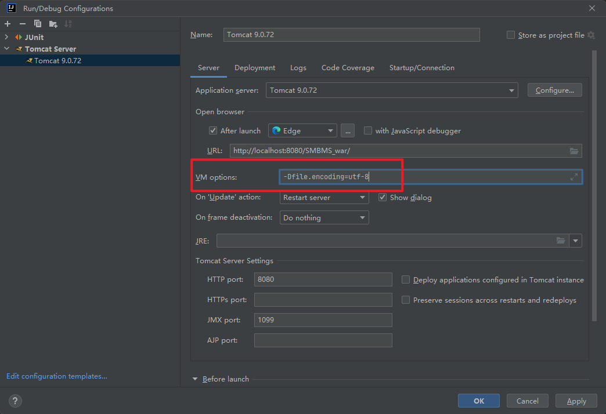

#超市订单管理系统(SMBMS)

作者： 黄一骏 (Huang Yijun)

技术栈： MVC + Servlet + JSP + JDBC + ajax 

update time:2023/3/4

### 项目整体模块图


### 开发过程中遇到的问题

#### 1.CSS文件加载不出来

解决方法：

看是否自己在过滤器那里写上了response.setcontenttype（“text/html;utf-8”），如果写上了login.jsp页面加载的时候css就会无效，因为这里需要的是html/css，就得在过滤器哪里把上面的话注释掉；

还有一种方案是将JSP页面的 <!DOCTYPE html>注释掉可以正常显示css样式


#### 2.${pageContext.request.contextPath}不生效

想通过${pageContext.request.contextPath}获取当前路径，然后发现这行代码被解析成了/$%7BpageContext.request.contextPath%7D，原因是因为web-app版本号过低。IDEA在创建javaweb项目的时候，web-app的版本默认是2.3，而要正确解析上面的代码获得当前路径，我们需要把web-app的版本手动改成2.5及以上版本。

解决方法：将web.xml的标签替换如下

```xml
<?xml version="1.0" encoding="UTF-8"?>
<web-app xmlns="http://xmlns.jcp.org/xml/ns/javaee"
         xmlns:xsi="http://www.w3.org/2001/XMLSchema-instance"
         xsi:schemaLocation="http://xmlns.jcp.org/xml/ns/javaee http://xmlns.jcp.org/xml/ns/javaee/web-app_4_0.xsd"
         version="4.0">
         
</web-app>
```


#### 3.新建用户界面出现乱码

添加了Filter过滤器，并且在jsp中也都加了charset="UTF-8"的声明，但在该界面部分内容仍然出现乱码。

解决方法：在Tomcat的VM OPTION设置中添加如下图所示的代码即可解决。




### 界面展示


